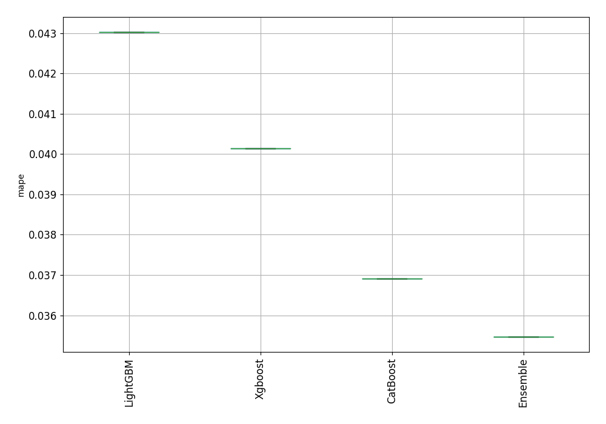
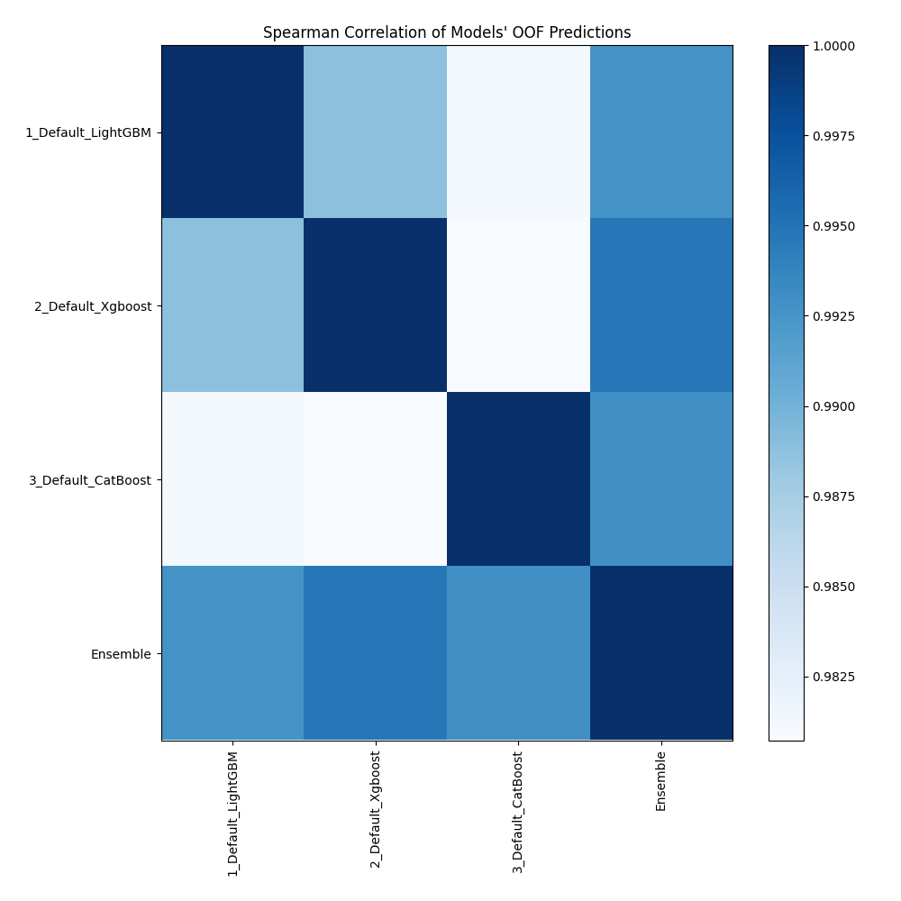

# AutoML Leaderboard

| Best model   | name                                               | model_type   | metric_type   |   metric_value |   train_time |
|:-------------|:---------------------------------------------------|:-------------|:--------------|---------------:|-------------:|
|              | [1_Default_LightGBM](1_Default_LightGBM/README.md) | LightGBM     | mape          |      0.0430291 |        18.33 |
|              | [2_Default_Xgboost](2_Default_Xgboost/README.md)   | Xgboost      | mape          |      0.0401356 |        15.78 |
|              | [3_Default_CatBoost](3_Default_CatBoost/README.md) | CatBoost     | mape          |      0.0369111 |         7.86 |
| **the best** | [Ensemble](Ensemble/README.md)                     | Ensemble     | mape          |      0.0354686 |         0.38 |

### AutoML Performance

### AutoML Performance Boxplot

### Spearman Correlation of Models

